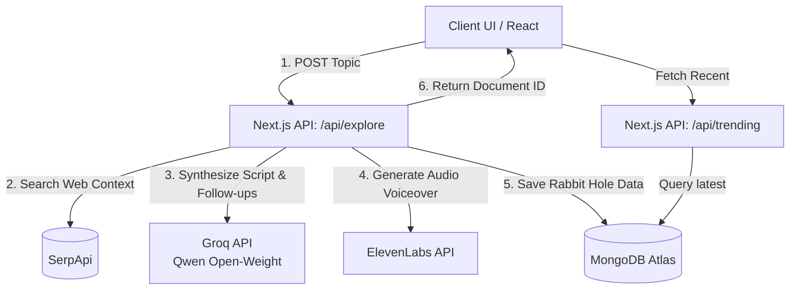

# 🕳️ Rabbit Hole Explorer

> Dive deep into obscure internet mysteries with AI-generated, fully-voiced mini-podcasts.


**Rabbit Hole Explorer** is a web application that cures "information fatigue." Instead of reading dry, lengthy Wikipedia articles about niche topics (like *The Great Emu War* or *Number Stations*), you simply type in a topic and the app automatically researches, synthesizes, and generates a personalized mini-podcast for you to listen to.

Built as a submission for the **Hacktoberfest 2026: Build for a Friend** challenge!

---

## ✨ Features

* **Interactive Neo-Brutalism UI:** A custom, vibrant design system featuring heavy borders, hard shadows, and a reactive pixel-art hover grid background.
* **Live Web Grounding:** Uses SerpApi to fetch real-time facts, preventing AI hallucinations.
* **Open-Weight AI Synthesis:** Powered by Qwen (via Groq) to instantly write engaging podcast scripts and factual summaries.
* **On-the-fly Text-to-Speech:** Uses ElevenLabs to voice the generated podcast script.
* **Explore the Warren:** A trending grid pulling the latest generated rabbit holes from MongoDB.
* **Go Deeper:** Dynamically generates 3 related follow-up topics to keep the user falling down the rabbit hole.

---

## 🏗️ System Architecture

The application relies on a serverless Next.js API architecture that acts as an orchestration layer between multiple external APIs and the database.



---

## 💻 Tech Stack

**Frontend**
* [Next.js 15](https://nextjs.org/) (App Router)
* [React 19](https://react.dev/)
* [Tailwind CSS](https://tailwindcss.com/) (Custom Neo-Brutalist configuration)
* [Framer Motion](https://www.framer.com/motion/) (Animations & Loading states)
* [Lucide Icons](https://lucide.dev/)

**Backend & Database**
* Next.js API Routes (Serverless functions)
* [MongoDB Atlas](https://www.mongodb.com/atlas)
* [Mongoose](https://mongoosejs.com/) (ODM)

**AI & APIs**
* [Groq](https://groq.com/) (Inference engine running `qwen/qwen3.8-27b`)
* [SerpApi](https://serpapi.com/) (Google Search API for factual grounding)
* [ElevenLabs](https://elevenlabs.io/) (Multilingual v2 Text-to-Speech)

---

## 🚀 Getting Started (Local Development)

### Prerequisites
Make sure you have Node.js (v18+) installed. You will also need free API keys from:
* [MongoDB Atlas](https://www.mongodb.com/) (Connection String)
* [Groq](https://console.groq.com/keys)
* [SerpApi](https://serpapi.com/)
* [ElevenLabs](https://elevenlabs.io/)

### 1. Clone the repository
```bash
git clone https://github.com/YOUR_USERNAME/rabbit-hole-explorer.git
cd rabbit-hole-explorer
```

### 2. Install dependencies
```bash
npm install
```

### 3. Set up Environment Variables
Create a `.env.local` file in the root of your project and add the following keys:
```env
# MongoDB Connection
MONGODB_URI=mongodb+srv://<username>:<password>@cluster.mongodb.net/rabbithole?retryWrites=true&w=majority

# APIs
GROQ_API_KEY=your_groq_api_key_here
SERPAPI_API_KEY=your_serpapi_api_key_here
ELEVENLABS_API_KEY=your_elevenlabs_api_key_here
```

### 4. Run the development server
```bash
npm run dev
```
Open [http://localhost:3000](http://localhost:3000) in your browser to start exploring!

---

## 🎨 Design Language (Vibrant Neo-Brutalism)
The UI embraces modern Neo-Brutalism, characterized by:
* High-contrast `2px` and `4px` solid black borders.
* Sharp, offset box-shadows (`4px 4px 0px 0px rgba(0,0,0,1)`).
* A vibrant, highly saturated pastel palette (Salmon Rose, Lilac Purple, Teal, Warm Yellow).
* An interactive `div`-based CSS grid background that reacts to mouse hovers with instant color pops and slow fades.

---
*Built with ❤️ for Hacktoberfest 2026*
